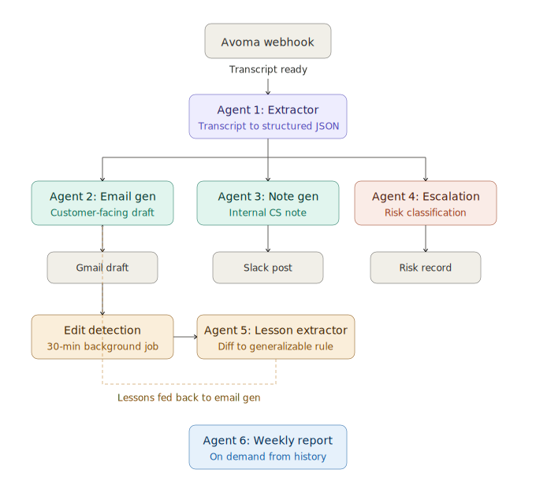

# Followloop

> A six-agent autonomous pipeline for B2B SaaS implementation work, built on the Claude API. Processes meeting transcripts into customer-facing email drafts, internal CS notes, escalation flags, and weekly status reports — and learns from every edit. Running in production over 38 meetings in 24 days.

---

## What this is

Followloop is a deployment from the AgentOps series — a documented account of putting an AI agent into a real implementation workflow, including the architectural decisions, what broke, what worked, and how I measured it.

I'm an Implementation PM. My job is taking enterprise customers from contract-signed to fully-adopted — onboarding, integration support, weekly syncs, escalations, status reporting. The work is meeting-heavy, and the per-meeting overhead (follow-up emails, internal notes, status reports) is what eats the hours that should go into actually unblocking customers.

I built Followloop on top of the Claude API to automate the per-meeting overhead. This case study covers the architecture, the evaluation methodology, and the metrics.

---

## Why "Followloop"

Two reasons. The first is the obvious one — it processes the *follow*-up after every meeting. The second matters more: there's a *loop*. The system watches what I edit before sending, learns from each correction, and feeds the lesson back into every future draft. That feedback loop is the part most LLM tools don't have. The name names it.

---

## The thesis: why six agents instead of one prompt

The first version of Followloop was one Claude prompt. *"Read this transcript, write a follow-up email."* It worked the way you'd expect — generic openers, action items in the wrong format, no awareness of what was already committed in last week's meeting, and tone that drifted toward Claude's default register rather than mine.

Every fix I tried inside that single prompt broke something else. Tightening the action-item format made the prose stilted. Adding "remember to match my writing style" made the model over-correct toward formal voice. Stuffing prior meeting context in made the prompt long enough that instruction-following degraded.

The diagnosis was that I was asking one prompt to do five different jobs at once: parse, generate, calibrate tone, check against history, assess sentiment. Each is a different task with different failure modes.

The architecture below is the result of strict separation of concerns. One agent, one job. The output of each is a well-typed input for the next. Errors are localized. When a draft is off, I can tell *which agent* was wrong, not just that the system was wrong.

---

## Architecture: six specialized agents



*The pipeline is triggered by an Avoma webhook when a transcript is ready. The Extractor parses the transcript into structured JSON, which fans out to three parallel agents. The Edit Lesson Extractor runs on a 30-minute background loop and feeds learned lessons back into the Email Generator. The Weekly Report Generator runs on demand from accumulated context.*

### Agent 1 — The Extractor

**Job:** Parse the transcript into structured JSON. Never writes prose.

**Why isolated:** Extraction errors compound downstream. If the extractor confuses a client-side action item with an internal one, every subsequent agent inherits that mistake. Forcing the extractor to output structured fields (with explicit owner, due date, action type) makes parsing failures loud instead of silent.

**Output schema:**

```json
{
  "meeting_type": "weekly_sync | onboarding | escalation | qbr",
  "client_action_items": [{ "action": "...", "owner": "...", "due_date": "..." }],
  "internal_action_items": [{ "action": "...", "owner": "...", "due_date": "..." }],
  "decisions_made": ["..."],
  "open_questions": ["..."],
  "next_meeting_commitment": "..."
}
```

This runs on Claude Sonnet with a system prompt that explicitly forbids prose output and a JSON schema constraint enforced via tool use.

### Agent 2 — The Email Generator

**Job:** Generate the customer-facing follow-up email.

**Inputs (this is the part that matters):**
- Structured output from the extractor
- The last N emails I sent to this client (so it knows what was already committed)
- The client's recent email replies (so it knows what was resolved outside calls)
- A bank of style samples — real emails I wrote for similar meeting types
- The accumulated edit lessons (see Agent 5)

The reason emails sound like me isn't that the prompt says "match my writing style." It's that the prompt contains 5–10 actual emails I wrote, segmented by meeting type, so Claude has direct examples to anchor against. Style instructions don't generalize. Style examples do.

This is also where Claude's prompt caching pays for itself — the style samples and accumulated lessons are static across calls and get cached, while the per-meeting context streams in fresh.

### Agent 3 — The Internal Note Generator

**Job:** Generate a candid internal note for the CS team. Different audience, different content.

**Why isolated:** Customer-facing and internal-facing writing have different optimization targets. The customer email optimizes for clarity and trust; the internal note optimizes for actionability and risk surfacing. Trying to derive one from the other compromises both.

The internal note includes:
- A one-line health read (color-coded)
- Internal action items not in the customer email
- Anything escalation-worthy that needs leadership awareness

### Agent 4 — The Escalation Analyzer

**Job:** Read the same transcript with a different question — *how is this customer feeling, and should anyone be worried?*

**Why isolated:** Sentiment analysis is a fundamentally different task from summarization. The summarizer wants to neutralize emotional content into action items. The escalation analyzer wants to *preserve and amplify* emotional signal. Same transcript, opposite optimization targets.

**Output:**

```json
{
  "risk_level": "low | monitor | high",
  "signals": ["specific quotes or paraphrases that indicate risk"],
  "sentiment_summary": "1–2 sentence read of where the customer is emotionally",
  "recommended_action": "what should happen next, if anything"
}
```

This output feeds an Escalation Radar view that ranks all active customers by risk level and meeting recency. It's the most differentiated piece of Followloop — and the one that surfaces value the other agents can't, because it operates across the portfolio, not per-meeting.

### Agent 5 — The Edit Lesson Extractor

**Job:** Watch what I edit, learn the pattern.

This is the agent I'm proudest of, because it's the one that makes Followloop improve without me explicitly teaching it. It's also the agent the name is built around — the *loop* in Followloop.

**Mechanism:**

1. Every 30 minutes, a background job checks Gmail for sent messages that match earlier drafts.
2. When it finds a match, it diffs draft → sent.
3. The diff plus the meeting type is passed to a Claude call with a structured-output schema:

```json
{
  "issue_type": "wrong_tone | missing_context | format_drift | name_correction | other",
  "severity": "minor | moderate | substantive",
  "description": "what was wrong about the draft",
  "lesson": "a generalizable rule for future drafts"
}
```

4. Lessons are stored, deduplicated, and injected into Agent 2's prompt for all future drafts.

**Why this matters:** Most LLM-powered tools are static after deployment. Followloop accumulates institutional knowledge of my preferences without requiring me to articulate them. The improvement is asymmetric to my effort — I edit a draft once, the system applies that lesson to every subsequent draft forever.

### Agent 6 — The Weekly Report Generator

**Job:** On-demand, generate a formatted weekly status report for any active customer.

Reads the last 14 days of accumulated context — extracted action items, sentiment trends, email threads — and generates the standard six-section report (issues for management attention, milestone table, work completed, work planned, customer responsibilities, joint actions).

**Why isolated:** Different cadence. Email/note/escalation run per-meeting; reports run per-week and need to roll up history. Different agent, different prompt, different evaluation criteria.

---

## Evaluation: how the metrics were measured

I'll describe what was measured, the date range, and the methodology — not just the numbers. Numbers without methodology aren't real metrics.

### Volume

- **38 meetings processed** over 24 days (April 14 – May 8)
- **~11 meetings/week** — every customer call I had during the period went through Followloop
- 100% pipeline coverage; no meetings skipped

### Edit behavior

- **3–4 drafts sent verbatim** — zero character-level changes between draft and sent
- **Remaining drafts: minor edits only** — name corrections, small phrasing preferences, occasional reordering of action items
- **Zero drafts rewritten from scratch** during the measurement period

This is the metric I trust most. Followloop isn't "good enough that I can stand it" — it's good enough that on a meaningful fraction of meetings, Claude's draft is shippable as-is. That's the threshold that matters.

### Time recovered

- **~25 minutes/email** baseline (measured prior to deployment by timing my own follow-up writing across a sample of meetings)
- **38 meetings × 25 min = ~16 hours recovered** in the 3.5-week period
- **~4.5 hours/week**, or roughly 11% of a 40-hour week

The honest framing: this isn't "AI replaced a part of my job." It's "AI moved the per-meeting overhead from 25 minutes of writing to 2 minutes of reviewing and pressing send." The hour count is the saved delta.

### Latency

- **<7 minutes** from Avoma transcript-ready event to draft-in-inbox + Slack ping
- **Same evening as the meeting**, every meeting, with no manual intervention

### Escalation accuracy

- **5 high-risk flags** raised over 38 meetings (~13% of meetings)
- **3–4 confirmed real** by my independent assessment
- **Zero missed escalations** — no customer surfaced as escalation-worthy later that Followloop hadn't already flagged

The 70% precision is the soft number. The 100% recall is the harder one — over the measurement period, Followloop did not miss a customer I subsequently determined needed attention. False positives are tolerable in this domain (they cost a 2-minute review). False negatives are not.

### What I haven't measured yet

- Long-term edit-rate trend (need more weeks of data to chart properly)
- Whether the edit-lesson loop is causally improving drafts vs. just accumulating lessons
- Customer-side impact (do customers report better follow-ups? — anecdotal yes, no quantitative measurement)

These are open instrumentation gaps. I'll publish updates as the data accumulates.

---

## What I got right

**Strict separation of concerns.** Every time I considered collapsing two agents into one, the quality regressed. Email generation and sentiment analysis are not the same task and shouldn't share a prompt.

**Style examples over style instructions.** "Match my writing style" is a useless instruction to Claude or any other model. Five real emails I wrote, segmented by meeting type, is a useful prompt.

**The edit-lesson loop.** The most differentiated piece. Most LLM systems are static after deployment. Followloop accumulates institutional knowledge of my preferences without requiring me to articulate them.

**Background instrumentation from day one.** Every agent's input and output is logged. When a draft is off, I can tell which agent failed.

**Building on Claude.** I won "Best Use of Claude" at Cal Hacks 12.0 for an earlier project (an eldercare voice companion), and the lessons from that hackathon — particularly around prompt engineering for reliability and using structured outputs to constrain failure modes — directly shaped Followloop's architecture.

## What I got wrong

**Underestimated Gmail API matching.** Detecting that a sent email corresponds to a specific earlier draft is non-trivial — signature variations, reply chains, timing. Took meaningful work to get right.

**Started without prompt caching.** Once I added prior_meetings + email_thread + style_samples + lessons all to Agent 2's system prompt, token costs climbed fast. Anthropic's prompt caching cut per-meeting cost substantially once I added it. Should have done this on day one.

**Built the dashboard before instrumenting agent outputs.** I added the dashboard early because it felt visible. The thing I actually needed in week two was per-agent input/output logs, which I added later. Operational visibility before user-facing visibility.

---

## What's portable, what's situated

Followloop is part of the AgentOps series, which is specifically about distinguishing the part of any deployment that generalizes from the part that's specific to one workflow.

**Portable:**

- The architectural pattern — extractor as first-stage, parallel specialized agents downstream, async edit-lesson feedback loop
- Style examples > style instructions for matching writer voice
- Separating customer-facing and internal-facing generation
- Sentiment analysis as a separate agent from summarization
- Background loop for autonomous improvement from corrections
- Prompt caching for stable system-prompt context

**Situated:**

- The specific meeting types (weekly sync, onboarding, escalation, QBR) — your domain has different ones
- The exact tools (Avoma, Gmail, Slack) — substitute equivalents
- The 25-minute-per-email baseline — domain-dependent
- The 14-day rollup window for weekly reports — calibrate to your reporting cadence

**Untransferable:**

- My specific writing style and the lessons accumulated against it
- The customer relationships that determine how to read sentiment in transcripts
- The institutional context that makes a "high-risk flag" actionable rather than noise

The portable layer is the architecture. The situated layer is the prompts. The untransferable layer is the institutional knowledge that gets baked in over time.

---

## What's next

- Multi-user support — extending Followloop's architecture to other implementation PMs with their own style profiles
- Long-horizon eval — measuring whether the edit-lesson loop causally improves draft quality over months, not weeks
- Proactive routing — when escalation analyzer flags `risk_level: high`, automatically loop in account leadership rather than waiting for the next standup

---

## Notes for engineers reading this

If you're building something similar:

- The single biggest quality unlock was extraction-before-generation. Don't ask one prompt to parse and generate.
- Claude's prompt caching pays for itself within ~50 calls if your system prompt has stable context.
- Async feedback loops > synchronous human-in-the-loop. Asking me to "rate this draft" each time is friction. Watching what I edit is invisible.
- Per-agent logs from day one. You will need them in week two.

If you want to compare notes on agentic pipelines for customer-facing implementation work, I'm reachable through the contact link on the AgentOps series page.

---

## Stack

- **LLM:** Claude Sonnet (Anthropic API), with prompt caching on stable system-prompt context
- **Backend:** Python, Flask
- **Database:** Supabase
- **Meeting source:** Avoma webhooks
- **Output channels:** Gmail API (drafts), Slack API (notifications)
- **Background jobs:** Cron-driven edit detection on 30-minute interval

---

*Followloop is part of the [AgentOps](https://github.com/Gaurav890/agentops-deployments) series — documented deployments of AI agents into real enterprise workflows, with architecture, evaluation methodology, and reflection on what worked. The methodology generalizes; the implementations are specific.*

*Author: Gaurav Chaulagain. Implementation PM, B2B SaaS. "Best Use of Claude" winner, Cal Hacks 12.0.*